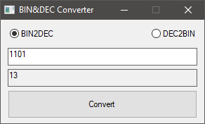

#  BIN&DEC Converter

This is a simple application written with purpose of being little more complicated "Hello World" example (for me at least) in C and WinAPI. It's simple BIN to DEC and vice versa converter with GUI using pure Windows API.

<span style="display:block;text-align:center">

## Building
I was using MinGW-w64 to build it so instructions are for MinGW but Visual Studio should compile this as well.

### Install Mingw-w64
Instructions on project page:
https://mingw-w64.org/doku.php

### Compile resource file
```sh
windres resources.rc -o resources.o
```

### Compile source code
```sh
gcc -o bindec.exe bindec.c resources.o -mwindows -lcomctl32 -s -O2 -Wall -pedantic
```

## License
BIN&DEC Converter is distributed under MIT License (see LICENSE file for more informations).